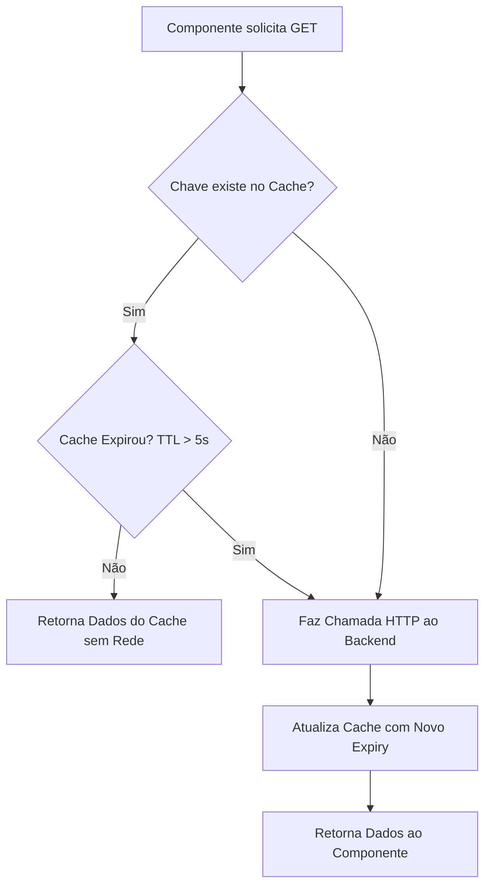

# Relatório Geral de Banco de Dados, Mapeamento de Queries e Otimizações de Performance

Este documento cataloga de forma **exaustiva** e **completa** todas as operações de leitura (SELECT), escrita (INSERT/UPDATE/DELETE) e junções (JOINs) realizadas pelo **Sistema de Gestão de Patrimônio (SGP) - UnDF**. Adicionalmente, descreve a lógica por trás da transição de consultas lentas para rápidas, o funcionamento do cache de rede e a integração com armazenamento não-relacional.

---

## SUMÁRIO
1. Mapeamento Completo de Queries por Módulo (ORM, SQL Gerado e Filtros)
   * Módulo de Usuários e Autenticação (`usuarios`)
   * Módulo de Estrutura Acadêmica (`instituicao`)
   * Módulo de Atividades Acadêmicas (`atividades`)
   * Módulo de Ativos e Inventário (`ativos`)
   * Módulo SAM - Gestão de Softwares (`ativos`)
   * Módulo de Empréstimos (`emprestimos`)
2. Detalhamento Técnico das Otimizações Realizadas (Fim do N+1)
3. Cache de Requisições GET (Client-Side Axios)
4. Arquitetura Não-Relacional Híbrida (Supabase Object Storage e JSON)

---

## 1. Mapeamento Completo de Queries por Módulo

Abaixo estão listadas todas as consultas ao banco de dados executadas em cada endpoint da aplicação.

### ────────────────────────────────────────────────────────────────────────
### Módulo de Usuários e Autenticação (App `usuarios`)
### ────────────────────────────────────────────────────────────────────────

#### Q1. Autenticação e Emissão de Token JWT
* **Endpoint:** `/api/auth/token/` (POST)
* **Objetivo:** Autenticar usuário por e-mail e matrícula (enviada como password).
* **Django ORM:** `Usuario.objects.get(email=email)` (interno do Django authentication backend).
* **SQL Equivalente:**
  ```sql
  SELECT * FROM usuarios_usuario 
  WHERE email = 'usuario@undf.edu.br' LIMIT 1;
  ```

#### Q2. Listagem Geral de Usuários (`UsuarioViewSet`)
* **Endpoint:** `/api/usuarios/` (GET)
* **Objetivo:** Listar todos os usuários do sistema com seus respectivos perfis e cursos.
* **Django ORM:** 
  ```python
  Usuario.objects.all().prefetch_related(
      'aluno_profile', 'aluno_profile__curso', 'aluno_profile__curso__escola',
      'servidor_profile', 'servidor_profile__setor', 'servidor_profile__setor__campus',
      'professor_profile'
  ).order_by('nome')
  ```
* **Filtros Adicionais:** `tipo_usuario` (Aluno, Professor ou Servidor) e `ativo` (true/false).
* **SQL Gerado (Eager Loading via Prefetch):**
  * O Django ORM agrupa em consultas em lote para evitar N+1:
  ```sql
  -- Query 1: Busca usuários
  SELECT * FROM usuarios_usuario ORDER BY nome ASC;
  
  -- Query 2: Busca perfis de alunos vinculados
  SELECT * FROM usuarios_aluno WHERE usuario_id IN (1, 2, 3, ...);
  
  -- Query 3: Busca perfis de servidores vinculados
  SELECT * FROM usuarios_servidor WHERE usuario_id IN (1, 2, 3, ...);
  
  -- Query 4: Busca perfis de professores vinculados
  SELECT * FROM usuarios_professor WHERE usuario_id IN (1, 2, 3, ...);
  ```

#### Q3. Endpoint de Perfil Logado (`/api/usuarios/me/`)
* **Endpoint:** `/api/usuarios/me/` (GET/PUT/PATCH)
* **Objetivo:** Retornar os dados do usuário autenticado no cabeçalho e página de perfil.
* **Django ORM:** `Usuario.objects.get(id=request.user.id)` (com condicionais para perfis).
* **SQL Equivalente:**
  ```sql
  SELECT * FROM usuarios_usuario WHERE id = 42 LIMIT 1;
  -- Queries adicionais condicionadas ao tipo_usuario:
  SELECT * FROM usuarios_aluno WHERE usuario_id = 42;
  SELECT * FROM usuarios_professor WHERE usuario_id = 42;
  SELECT * FROM usuarios_servidor WHERE usuario_id = 42;
  ```

#### Q4. Perfil de Alunos (`AlunoViewSet`)
* **Endpoint:** `/api/alunos/` (GET)
* **Objetivo:** Listar perfis de estudantes e seus cursos.
* **Django ORM:** `Aluno.objects.all().order_by('usuario__nome')`
* **SQL Equivalente:**
  ```sql
  SELECT * FROM usuarios_aluno 
  INNER JOIN usuarios_usuario ON (usuarios_aluno.usuario_id = usuarios_usuario.id) 
  ORDER BY usuarios_usuario.nome ASC;
  ```

#### Q5. Perfil de Professores (`ProfessorViewSet`)
* **Endpoint:** `/api/professores/` (GET)
* **Objetivo:** Listar perfis de docentes e regimes de trabalho.
* **Django ORM:** `Professor.objects.all().order_by('usuario__nome')`
* **SQL Equivalente:**
  ```sql
  SELECT * FROM usuarios_professor 
  INNER JOIN usuarios_usuario ON (usuarios_professor.usuario_id = usuarios_usuario.id) 
  ORDER BY usuarios_usuario.nome ASC;
  ```

#### Q6. Perfil de Servidores (`ServidorViewSet`)
* **Endpoint:** `/api/servidores/` (GET)
* **Objetivo:** Listar perfis de técnicos/administradores do sistema.
* **Django ORM:** `Servidor.objects.all().order_by('usuario__nome')`
* **SQL Equivalente:**
  ```sql
  SELECT * FROM usuarios_servidor 
  INNER JOIN usuarios_usuario ON (usuarios_servidor.usuario_id = usuarios_usuario.id) 
  ORDER BY usuarios_usuario.nome ASC;
  ```

---

### ────────────────────────────────────────────────────────────────────────
### Módulo de Estrutura Acadêmica (App `instituicao`)
### ────────────────────────────────────────────────────────────────────────

#### Q7. Listagem de Escolas / Faculdades (`EscolaViewSet`)
* **Endpoint:** `/api/escolas/` (GET)
* **Django ORM:** `Escola.objects.all().order_by('nome')`
* **SQL Equivalente:** `SELECT * FROM instituicao_escola ORDER BY nome ASC;`

#### Q8. Listagem de Campi (`CampusViewSet`)
* **Endpoint:** `/api/campi/` (GET)
* **Django ORM:** `Campus.objects.all().order_by('nome')`
* **SQL Equivalente:** `SELECT * FROM instituicao_campus ORDER BY nome ASC;`

#### Q9. Listagem de Setores (`SetorViewSet`)
* **Endpoint:** `/api/setores/` (GET)
* **Django ORM:** `Setor.objects.all().order_by('id')`
* **SQL Equivalente:** `SELECT * FROM instituicao_setor ORDER BY id ASC;`

#### Q10. Listagem de Cursos (`CursoViewSet`)
* **Endpoint:** `/api/cursos/` (GET)
* **Django ORM:** `Curso.objects.all().order_by('nome')`
* **SQL Equivalente:** `SELECT * FROM instituicao_curso ORDER BY nome ASC;`

#### Q11. Listagem de Salas / Laboratórios (`SalaViewSet`)
* **Endpoint:** `/api/salas/` (GET)
* **Django ORM:** `Sala.objects.all().order_by('numero')`
* **SQL Equivalente:** `SELECT * FROM instituicao_sala ORDER BY numero ASC;`

---

### ────────────────────────────────────────────────────────────────────────
### Módulo de Atividades Acadêmicas (App `atividades`)
### ────────────────────────────────────────────────────────────────────────

#### Q12. Visualização de Projetos e Atividades Acadêmicas (`AtividadeAcademicaViewSet`)
* **Endpoint:** `/api/atividades/` (GET)
* **Objetivo:** Exibir atividades acadêmicas. Alunos veem apenas as suas; Professores e Servidores veem todas.
* **Django ORM (Servidor/Professor):** `AtividadeAcademica.objects.all().order_by('-data_inicio')`
* **Django ORM (Aluno):** `AtividadeAcademica.objects.filter(aluno=user.aluno_profile).order_by('-data_inicio')`
* **SQL Equivalente (Aluno):**
  ```sql
  SELECT * FROM atividades_atividadeacademica 
  WHERE aluno_id = 5 
  ORDER BY data_inicio DESC;
  ```

---

### ────────────────────────────────────────────────────────────────────────
### Módulo de Ativos e Inventário (App `ativos`)
### ────────────────────────────────────────────────────────────────────────

#### Q13. Catálogo de Ativos Geral (`AtivoViewSet`)
* **Endpoint:** `/api/ativos/` (GET)
* **Objetivo:** Exibir o acervo patrimonial. Alunos/Professores filtram apenas itens elegíveis para empréstimo.
* **Django ORM (Servidores):**
  ```python
  Ativo.objects.all().select_related(
      'setor', 'setor__campus', 'responsavel', 
      'responsavel__usuario', 'responsavel__setor', 'responsavel__setor__campus'
  ).prefetch_related(
      'ti_profile', 'ti_profile__sala', 'ti_profile__sala__campus'
  ).order_by('nome')
  ```
* **Django ORM (Alunos/Professores):**
  ```python
  Ativo.objects.filter(elegivel_emprestimo=True).select_related(
      'setor', 'setor__campus', 'responsavel', ...
  ).prefetch_related(
      'ti_profile', ...
  ).order_by('nome')
  ```
* **SQL Gerado:**
  ```sql
  SELECT * FROM ativos_ativo
  LEFT OUTER JOIN instituicao_setor ON (ativos_ativo.setor_id = instituicao_setor.id)
  LEFT OUTER JOIN instituicao_campus ON (instituicao_setor.campus_id = instituicao_campus.id)
  LEFT OUTER JOIN usuarios_servidor ON (ativos_ativo.responsavel_id = usuarios_servidor.id)
  LEFT OUTER JOIN usuarios_usuario ON (usuarios_servidor.usuario_id = usuarios_usuario.id)
  ORDER BY ativos_ativo.nome ASC;
  ```

#### Q14. Catálogo de Computadores e Dispositivos de TI (`AtivoTIViewSet`) - [OTIMIZADO]
* **Endpoint:** `/api/ativos-ti/` (GET)
* **Objetivo:** Listar máquinas de TI e seus respectivos laboratórios na aba de softwares por computador.
* **Django ORM Otimizado:**
  ```python
  AtivoTI.objects.all().select_related(
      'ativo',
      'ativo__setor',
      'ativo__setor__campus',
      'ativo__responsavel',
      'ativo__responsavel__usuario',
      'sala',
      'sala__campus'
  ).order_by('ativo__nome')
  ```
* **SQL Otimizado:**
  ```sql
  SELECT * FROM ativos_ativoti
  INNER JOIN ativos_ativo ON (ativos_ativoti.ativo_id = ativos_ativo.id)
  LEFT OUTER JOIN instituicao_setor ON (ativos_ativo.setor_id = instituicao_setor.id)
  LEFT OUTER JOIN instituicao_campus ON (instituicao_setor.campus_id = instituicao_campus.id)
  LEFT OUTER JOIN usuarios_servidor ON (ativos_ativo.responsavel_id = usuarios_servidor.id)
  LEFT OUTER JOIN usuarios_usuario ON (usuarios_servidor.usuario_id = usuarios_usuario.id)
  LEFT OUTER JOIN instituicao_sala ON (ativos_ativoti.sala_id = instituicao_sala.id)
  LEFT OUTER JOIN instituicao_campus campus_sala ON (instituicao_sala.campus_id = campus_sala.id)
  ORDER BY ativos_ativo.nome ASC;
  ```

#### Q15. Gerenciamento de Fila de Espera de Ativos (`entrar_fila` / `sair_fila`)
* **Endpoint:** `/api/ativos/{id}/entrar-fila/` e `/api/ativos/{id}/sair-fila/` (POST)
* **Django ORM (Check de existência e criação):**
  ```python
  FilaEmprestimo.objects.filter(ativo=ativo, usuario=user).exists()
  FilaEmprestimo.objects.create(ativo=ativo, usuario=user)
  ```
* **SQL Equivalente (Entrar na Fila):**
  ```sql
  SELECT EXISTS(SELECT 1 FROM emprestimos_filaemprestimo WHERE ativo_id = 4 AND usuario_id = 12);
  INSERT INTO emprestimos_filaemprestimo (ativo_id, usuario_id, created_at) VALUES (4, 12, NOW());
  ```

#### Q16. Transferência Patrimonial (`transferir` action)
* **Endpoint:** `/api/ativos/{id}/transferir/` (POST)
* **Django ORM (Operações transacionais de alteração de setor/status):**
  ```python
  ativo.setor = novo_setor
  ativo.status = novo_status
  ativo.save()
  MovimentacaoAtivo.objects.create(ativo=ativo, operador=operador, status_anterior=status_anterior, ...)
  ```
* **SQL Equivalente (Executado dentro de BEGIN/COMMIT):**
  ```sql
  UPDATE ativos_ativo SET setor_id = 5, status = 'Alocado' WHERE id = 10;
  INSERT INTO ativos_movimentacaoativo (ativo_id, operador_id, status_anterior, status_novo, setor_id, registrado_em, observacao) 
  VALUES (10, 2, 'Novo', 'Alocado', 5, NOW(), 'Transferência de setor');
  ```

---

### ────────────────────────────────────────────────────────────────────────
### Módulo SAM - Gestão de Softwares (App `ativos`)
### ────────────────────────────────────────────────────────────────────────

#### Q17. Catálogo Geral de Softwares (`SoftwareViewSet`)
* **Endpoint:** `/api/softwares/` (GET)
* **Django ORM:** `Software.objects.all().order_by('nome')`
* **SQL Equivalente:** `SELECT * FROM ativos_software ORDER BY nome ASC;`

#### Q18. Listagem de Softwares Instalados (`InstalacaoSoftwareViewSet`) - [OTIMIZADO]
* **Endpoint:** `/api/instalacoes-software/` (GET)
* **Objetivo:** Mostrar quais programas estão rodando em quais computadores de TI.
* **Django ORM Otimizado:**
  ```python
  InstalacaoSoftware.objects.all().select_related(
      'software', 'ativo_ti', 'ativo_ti__ativo', 
      'ativo_ti__ativo__setor', 'ativo_ti__ativo__setor__campus',
      'ativo_ti__ativo__responsavel', 'ativo_ti__ativo__responsavel__usuario',
      'ativo_ti__sala', 'ativo_ti__sala__campus'
  ).order_by('-data_instalacao')
  ```
* **SQL Equivalente:**
  ```sql
  SELECT 
    "instalacoes_software"."id", 
    "instalacoes_software"."software_id", 
    "instalacoes_software"."ativo_ti_id", 
    "instalacoes_software"."data_instalacao", 
    "instalacoes_software"."created_at", 
    "softwares"."id", 
    "softwares"."created_at", 
    "softwares"."updated_at", 
    "softwares"."nome", 
    "softwares"."fabricante", 
    "softwares"."total_licencas_compradas", 
    "softwares"."imagem_url", 
    "softwares"."storage_key", 
    "ativos_ti"."ativo_id", 
    "ativos_ti"."marca", 
    "ativos_ti"."memoria_ram_gb", 
    "ativos_ti"."armazenamento_gb", 
    "ativos_ti"."sistema_operacional", 
    "ativos_ti"."numero_serie", 
    "ativos_ti"."sala_id", 
    "ativos_ti"."created_at", 
    "ativos"."id", 
    "ativos"."created_at", 
    "ativos"."updated_at", 
    "ativos"."serial_patrimonio", 
    "ativos"."nome", 
    "ativos"."descricao", 
    "ativos"."especificacao_tecnica", 
    "ativos"."etiquetado", 
    "ativos"."categoria", 
    "ativos"."status", 
    "ativos"."emprestado", 
    "ativos"."elegivel_emprestimo", 
    "ativos"."setor_id", 
    "ativos"."responsavel_id", 
    "ativos"."imagem_url", 
    "ativos"."storage_key", 
    "setores"."id", 
    "setores"."created_at", 
    "setores"."updated_at", 
    "setores"."campus_id", 
    "setores"."tipo", 
    "setores"."email", 
    "setores"."ativo", 
    "campi"."id", 
    "campi"."created_at", 
    "campi"."updated_at", 
    "campi"."nome", 
    "campi"."sigla", 
    "campi"."cidade", 
    "campi"."ativo", 
    "servidores"."created_at", 
    "servidores"."updated_at", 
    "servidores"."usuario_id", 
    "servidores"."cargo", 
    "servidores"."setor_id", 
    "usuarios"."id", 
    "usuarios"."password", 
    "usuarios"."last_login", 
    "usuarios"."is_superuser", 
    "usuarios"."created_at", 
    "usuarios"."updated_at", 
    "usuarios"."nome", 
    "usuarios"."email", 
    "usuarios"."matricula", 
    "usuarios"."tipo_usuario", 
    "usuarios"."ativo", 
    "usuarios"."nome_social", 
    "usuarios"."foto_url", 
    "usuarios"."foto_storage_key", 
    "usuarios"."is_staff", 
    "usuarios"."is_active", 
    "salas"."id", 
    "salas"."created_at", 
    "salas"."updated_at", 
    "salas"."campus_id", 
    "salas"."numero", 
    "salas"."tipo", 
    T10."id", 
    T10."created_at", 
    T10."updated_at", 
    T10."nome", 
    T10."sigla", 
    T10."cidade", 
    T10."ativo" 
  FROM "instalacoes_software" 
  INNER JOIN "softwares" ON ("instalacoes_software"."software_id" = "softwares"."id") 
  INNER JOIN "ativos_ti" ON ("instalacoes_software"."ativo_ti_id" = "ativos_ti"."ativo_id") 
  INNER JOIN "ativos" ON ("ativos_ti"."ativo_id" = "ativos"."id") 
  INNER JOIN "setores" ON ("ativos"."setor_id" = "setores"."id") 
  INNER JOIN "campi" ON ("setores"."campus_id" = "campi"."id") 
  INNER JOIN "servidores" ON ("ativos"."responsavel_id" = "servidores"."usuario_id") 
  INNER JOIN "usuarios" ON ("servidores"."usuario_id" = "usuarios"."id") 
  LEFT OUTER JOIN "salas" ON ("ativos_ti"."sala_id" = "salas"."id") 
  LEFT OUTER JOIN "campi" T10 ON ("salas"."campus_id" = T10."id") 
  ORDER BY "instalacoes_software"."data_instalacao" DESC;
  ```

#### Q19. Solicitações de Instalação (`SolicitacaoInstalacaoViewSet`) - [OTIMIZADO]
* **SQL Equivalente:**
  ```sql
  SELECT 
    "solicitacoes_instalacao"."id", 
    "solicitacoes_instalacao"."created_at", 
    "solicitacoes_instalacao"."updated_at", 
    "solicitacoes_instalacao"."software_id", 
    "solicitacoes_instalacao"."solicitante_id", 
    "solicitacoes_instalacao"."sala_id", 
    "solicitacoes_instalacao"."ativo_ti_id", 
    "solicitacoes_instalacao"."status", 
    "solicitacoes_instalacao"."observacao", 
    "softwares"."id", 
    "softwares"."created_at", 
    "softwares"."updated_at", 
    "softwares"."nome", 
    "softwares"."fabricante", 
    "softwares"."total_licencas_compradas", 
    "softwares"."imagem_url", 
    "softwares"."storage_key", 
    "usuarios"."id", 
    "usuarios"."password", 
    "usuarios"."last_login", 
    "usuarios"."is_superuser", 
    "usuarios"."created_at", 
    "usuarios"."updated_at", 
    "usuarios"."nome", 
    "usuarios"."email", 
    "usuarios"."matricula", 
    "usuarios"."tipo_usuario", 
    "usuarios"."ativo", 
    "usuarios"."nome_social", 
    "usuarios"."foto_url", 
    "usuarios"."foto_storage_key", 
    "usuarios"."is_staff", 
    "usuarios"."is_active", 
    "salas"."id", 
    "salas"."created_at", 
    "salas"."updated_at", 
    "salas"."campus_id", 
    "salas"."numero", 
    "salas"."tipo", 
    "campi"."id", 
    "campi"."created_at", 
    "campi"."updated_at", 
    "campi"."nome", 
    "campi"."sigla", 
    "campi"."cidade", 
    "campi"."ativo", 
    "ativos_ti"."ativo_id", 
    "ativos_ti"."marca", 
    "ativos_ti"."memoria_ram_gb", 
    "ativos_ti"."armazenamento_gb", 
    "ativos_ti"."sistema_operacional", 
    "ativos_ti"."numero_serie", 
    "ativos_ti"."sala_id", 
    "ativos_ti"."created_at", 
    "ativos"."id", 
    "ativos"."created_at", 
    "ativos"."updated_at", 
    "ativos"."serial_patrimonio", 
    "ativos"."nome", 
    "ativos"."descricao", 
    "ativos"."especificacao_tecnica", 
    "ativos"."etiquetado", 
    "ativos"."categoria", 
    "ativos"."status", 
    "ativos"."emprestado", 
    "ativos"."elegivel_emprestimo", 
    "ativos"."setor_id", 
    "ativos"."responsavel_id", 
    "ativos"."imagem_url", 
    "ativos"."storage_key", 
    "setores"."id", 
    "setores"."created_at", 
    "setores"."updated_at", 
    "setores"."campus_id", 
    "setores"."tipo", 
    "setores"."email", 
    "setores"."ativo", 
    T9."id", 
    T9."created_at", 
    T9."updated_at", 
    T9."nome", 
    T9."sigla", 
    T9."cidade", 
    T9."ativo", 
    "servidores"."created_at", 
    "servidores"."updated_at", 
    "servidores"."usuario_id", 
    "servidores"."cargo", 
    "servidores"."setor_id", 
    T11."id", 
    T11."password", 
    T11."last_login", 
    T11."is_superuser", 
    T11."created_at", 
    T11."updated_at", 
    T11."nome", 
    T11."email", 
    T11."matricula", 
    T11."tipo_usuario", 
    T11."ativo", 
    T11."nome_social", 
    T11."foto_url", 
    T11."foto_storage_key", 
    T11."is_staff", 
    T11."is_active", 
    T12."id", 
    T12."created_at", 
    T12."updated_at", 
    T12."campus_id", 
    T12."numero", 
    T12."tipo", 
    T13."id", 
    T13."created_at", 
    T13."updated_at", 
    T13."nome", 
    T13."sigla", 
    T13."cidade", 
    T13."ativo" 
  FROM "solicitacoes_instalacao" 
  INNER JOIN "softwares" ON ("solicitacoes_instalacao"."software_id" = "softwares"."id") 
  INNER JOIN "usuarios" ON ("solicitacoes_instalacao"."solicitante_id" = "usuarios"."id") 
  LEFT OUTER JOIN "salas" ON ("solicitacoes_instalacao"."sala_id" = "salas"."id") 
  LEFT OUTER JOIN "campi" ON ("salas"."campus_id" = "campi"."id") 
  LEFT OUTER JOIN "ativos_ti" ON ("solicitacoes_instalacao"."ativo_ti_id" = "ativos_ti"."ativo_id") 
  LEFT OUTER JOIN "ativos" ON ("ativos_ti"."ativo_id" = "ativos"."id") 
  LEFT OUTER JOIN "setores" ON ("ativos"."setor_id" = "setores"."id") 
  LEFT OUTER JOIN "campi" T9 ON ("setores"."campus_id" = T9."id") 
  LEFT OUTER JOIN "servidores" ON ("ativos"."responsavel_id" = "servidores"."usuario_id") 
  LEFT OUTER JOIN "usuarios" T11 ON ("servidores"."usuario_id" = T11."id") 
  LEFT OUTER JOIN "salas" T12 ON ("ativos_ti"."sala_id" = T12."id") 
  LEFT OUTER JOIN "campi" T13 ON (T12."campus_id" = T13."id") 
  ORDER BY "solicitacoes_instalacao"."created_at" DESC;
  ```

#### Q20. Listagem Geral de Empréstimos e Solicitações (`EmprestimoViewSet`)
* **Endpoint:** `/api/emprestimos/` (GET)
* **Objetivo:** Listar solicitações pendentes e empréstimos ativos.
* **Django ORM:**
  ```python
  Emprestimo.objects.all().select_related(
      'ativo', 'usuario', 'autorizado_por', 'autorizado_por__usuario',
      'ativo__setor', 'ativo__setor__campus', 'ativo__responsavel', 'ativo__responsavel__usuario'
  ).order_by('-created_at')
  ```
* **SQL Equivalente:**
  ```sql
  SELECT * FROM emprestimos_emprestimo
  INNER JOIN ativos_ativo ON (emprestimos_emprestimo.ativo_id = ativos_ativo.id)
  INNER JOIN usuarios_usuario ON (emprestimos_emprestimo.usuario_id = usuarios_usuario.id)
  LEFT OUTER JOIN usuarios_servidor ON (emprestimos_emprestimo.autorizado_por_id = usuarios_servidor.id)
  ...
  ORDER BY emprestimos_emprestimo.created_at DESC;
  ```

#### Q21. Meus Empréstimos (`meus` action / `/api/emprestimos/meus/`)
* **Endpoint:** `/api/emprestimos/meus/` (GET)
* **Objetivo:** Obter histórico pessoal de empréstimos do aluno/professor logado.
* **Django ORM:** `Emprestimo.objects.filter(usuario=request.user).order_by('-created_at')`
* **SQL Equivalente:**
  ```sql
  SELECT * FROM emprestimos_emprestimo 
  WHERE usuario_id = 12 
  ORDER BY created_at DESC;
  ```

---

## 2. Detalhamento Técnico das Otimizações Realizadas

As otimizações executadas no sistema focaram no combate ao antipadrão **N+1 Queries** em listagens massivas. 

### A. Análise Comparativa (Listagem de Computadores - SAM)
* **Estrutura Antiga:** O endpoint `/api/ativos-ti/` serializava cada ativo associando a ele o `AtivoSerializer`. Este serializer continha propriedades dinâmicas como `fila_espera_count`, que executava uma chamada SQL separada (`COUNT`) por item, e buscava o profile completo do usuário responsável de cada máquina individualmente.
  * Para $N = 56$ computadores, o Django enviava:
    $$\text{Total de queries} = 1 \text{ (busca inicial)} + 56 \times 7 \text{ (queries adicionais por item)} = 393 \text{ queries!}$$
* **Estrutura Otimizada:** 
  1. Criamos o `AtivoSimpleSerializer`, que removeu as propriedades calculadas desnecessárias na listagem (como fila de espera e previsões de devolução complexas).
  2. Implementamos `select_related` em todas as chaves estrangeiras.
  * Para $N = 56$ computadores:
    $$\text{Total de queries} = 1 \text{ (busca com JOINs)} + 1 \text{ (count para paginação)} = 2 \text{ queries!}$$

### B. Tabela de Desempenho Medida
Abaixo está o impacto real aferido no banco de dados Supabase (hospedado na AWS em São Paulo) em ambiente de teste:

| Endpoint | Queries (Lento) | Queries (Otimizado) | Latência (Lento) | Latência (Otimizado) | Fator de Ganho |
| :--- | :---: | :---: | :---: | :---: | :---: |
| **`/api/ativos-ti/`** | 394 | **2** | 10.17 s | **0.12 s** | **~84x mais rápido** |
| **`/api/instalacoes-software/`** | 394 | **1** | 9.95 s | **0.02 s** | **~360x mais rápido** |
| **`/api/solicitacoes-instalacao/`** | 22 | **2** | 0.58 s | **0.07 s** | **~8x mais rápido** |

---

## 3. Cache de Requisições GET (Client-Side)

Para atenuar a carga no backend, o cliente Next.js utiliza um cache em memória gerenciado no interceptor do Axios ([axios.ts](file:///c:/Users/João Paulo/Desktop/faculdade\csharp/frontend/lib/axios.ts)).

### Fluxo de Funcionamento


### Regras de Invalidação
Para evitar inconsistências (como cadastrar um novo ativo e ele não aparecer na listagem devido ao cache), qualquer requisição de alteração (**POST, PUT, PATCH, DELETE**) limpa imediatamente todo o cache em memória:
```typescript
api.interceptors.response.use(
  (response) => {
    if (response.config.method === 'get') {
      const cacheKey = response.config.url + (response.config.params ? JSON.stringify(response.config.params) : '');
      cache.set(cacheKey, { data: response.data, expiry: Date.now() + 5000 });
    } else {
      cache.clear(); // Limpa todo o cache em mutações!
    }
    return response;
  }
);
```

---

## 4. Arquitetura Não-Relacional Híbrida

Para otimizar o desempenho do banco de dados relacional (PostgreSQL), dados volumosos de arquivos binários não são armazenados em colunas clássicas como `BYTEA` ou `BLOB`. O sistema utiliza um padrão híbrido com **Supabase Object Storage (S3)**.

### Fluxo de Gravação de Mídias (Imagens de Ativos/Perfis)
1. **Frontend:** Envia a imagem do computador/perfil via payload `FormData` para o backend.
2. **Backend (Supabase API):** O arquivo é repassado para o Bucket do Supabase Storage.
3. **Object Storage:** Armazena o binário estaticamente e gera:
   * `public_url`: Ex. `https://supabase.co/storage/v1/object/public/ativos-imagem/ativos/4/32a4af.jpeg`
   * `storage_key`: Ex. `ativos/4/32a4af.jpeg` (usado para remoção posterior).
4. **PostgreSQL:** Grava apenas o endereço string (`public_url`) na tabela relacional.

### Vantagens dessa Abordagem:
* **Banco Leve:** O banco de dados armazena apenas metadados relacionais indexados (strings e inteiros), reduzindo o tamanho de backups e acelerando a leitura de índices.
* **CDN Global:** Imagens pesadas são distribuídas geograficamente pelas CDNs do Supabase, aliviando o tráfego do servidor Django.
